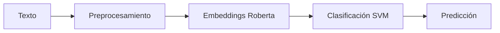

# Analizador de Sentimientos con SVM y Embeddings de Roberta

Un sistema avanzado de análisis de sentimientos en español que combina Support Vector Machine (SVM) con embeddings del modelo Roberta para clasificación de textos.

## Pipeline del Sistema


## Características

### Modelos y Técnicas
- Embeddings contextuales de `PlanTL-GOB-ES/roberta-base-bne`
- Clasificación mediante SVM, Naive Bayes y KNN
- Balanceo de datos con SMOTE
- Validación cruzada y métricas de evaluación

### Procesamiento
- Limpieza y normalización de texto
- Lematización con spaCy
- Manejo de características específicas del español
- Eliminación inteligente de stopwords

### Evaluación y Visualización
- Matrices de confusión
- Reportes de clasificación
- Visualizaciones interactivas
- Métricas por modelo

## Instalación

### 1. Clonar el Repositorio
```bash
git clone https://github.com/AsperSTS/simple_sentiment_analyzer_model.git
cd simple_sentiment_analyzer_model
```

### 2. Configurar el Entorno

#### Usando Anaconda creamos un nuevo entorno
```bash
# Crear el entorno desde el archivo environment.yml
conda env create -f environment.yml

# Activar el entorno
conda activate sentiment_analyzer_env
```

#### Instalamos dependencias faltantes con pip
```bash
# Instalar dependencias
pip install -r requirements.txt
```

### 3. Instalar Recursos Lingüísticos
```bash
python -m spacy download es_core_news_sm
```

## Clasificación de Sentimientos
- Alegría
- Tristeza
- Estrés
- Inquietud
- Miedo
- Enojo

## Requisitos del Sistema
- Python 3.9+
- 8GB RAM mínimo

