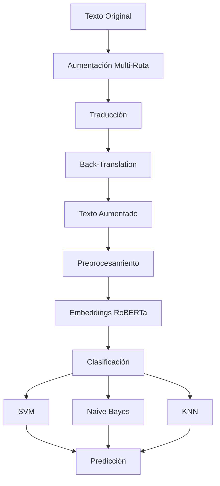

# Sistema de Análisis de Sentimientos y Aumentación de Datos

Este proyecto combina un sistema de aumentación de datos mediante traducción multi-ruta con un analizador de sentimientos que utiliza embeddings de RoBERTa y múltiples clasificadores.

## Pipeline del Sistema


## Características

### Aumentación de Datos
- Traducción bidireccional a través de múltiples rutas lingüísticas
- Procesamiento por lotes

### Análisis de Sentimientos
- Embeddings contextuales de `PlanTL-GOB-ES/roberta-base-bne`
- Clasificadores múltiples:
  - SVM (parámetros optimizados: C=7.21, gamma=0.6069, kernel=rbf)
  - Naive Bayes Gaussiano
  - KNN (n_neighbors=6)
- Balanceo de datos con SMOTE
- Validación cruzada 
- Búsqueda aleatoria de hiperparámetros

### Procesamiento de Texto
- Limpieza y normalización avanzada
- Lematización con spaCy (es_core_news_sm)
- Eliminación de stopwords específicas del español
- Manejo de caracteres especiales y acentos
- Tokenización mediante RoBERTa

### Evaluación y Métricas
- Validación cruzada con 5 folds
- Matrices de confusión
- Reportes de clasificación detallados
- Métricas por modelo
- Tiempos de ejecución
- Visualizaciones interactivas

### Clasificación de Sentimientos
- Alegría (preguntas 1, 6)
- Tristeza (pregunta 2)
- Estrés (preguntas 3, 9)
- Inquietud (preguntas 4, 5)
- Miedo (preguntas 7, 10)
- Enojo (pregunta 8)

## Instalación

### 1. Clonar el Repositorio
```bash
git clone https://github.com/AsperSTS/simple_sentiment_analyzer_model.git
cd simple_sentiment_analyzer_model
```

### 2. Configurar el Entorno

#### Usando Anaconda
```bash
# Crear el entorno desde el archivo environment.yml
conda env create -f environment.yml

# Activar el entorno
conda activate sentiment_analyzer_env
```

#### O usando pip
```bash
# Instalar dependencias
pip install -r requirements.txt
```

### 3. Instalar Recursos Lingüísticos
```bash
python -m spacy download es_core_news_sm
```

## Uso

### Aumentación de Datos
- Primero asegurarse de tener el csv normalizado y en utf8

```python
 python back_translation.py
```

### Análisis de Sentimientos
- Primero asegurarse de tener el csv con las columnas normalizadas
```python
python sentiment_analyzer.py
```

### Interfaz grafica
- Asegurarse de tener las dependencias necesarias  
```python
streamlit run use_model_gui.py
```

## Estructura del Proyecto
```
proyecto/
├── experiments/          # Directorio de experimentos
├── best_models/         # Modelos guardados
├── utils.py            # Utilidades y funciones auxiliares
├── requirements.txt    # Dependencias del proyecto
└── README.md          # Documentación
```

## Requisitos del Sistema
- Python 3.11+
- 8GB RAM mínimo
- Espacio en disco 

